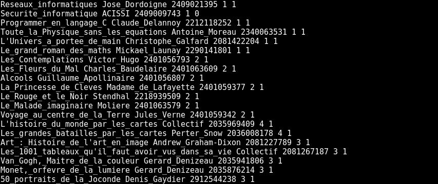

# CY-biblioTECH
A program to automatically manage the book stock of a university library !

## Installation

### Installing GCC on Ubuntu

Install the ```build-essential``` package by typing :

    sudo apt install build-essential

The command installs a bunch of new packages including ```gcc``` and ```make```.

### Clone the repository

Create your local clone of the ```CY-biblioTECH``` repository by typing :
    
    git clone https://github.com/melvinhqb/CY-biblioTECH.git

## Using CY-biblioTECH

### Compile CY-biblioTECH

Compile all the files needed to run the program by typing :

    make all

or

    make

### Run CY-biblioTECH

Run the compiled program by typing :

    ./exec

### Show all the Makefile's functions

More information about secondary commands by typing :

    make help

## Program features

### Account creation

The account creation function requires a __non-existent user name__ and a __secure password__.


### Account connection

The function of connection to an account requires to give a __username__ and a __password__ registered __in the database__.


### Book reservetion

The book reservation function requires that there are __no delays__ in returning a book. Do a __book search__ (2 or 3 letters are sometimes enough) and select the __type of sorting__. Finally, simply __enter the number of the book__ you wish to return.


### Book return

The book return function requires that you have __reserved at least one book__. Simply __enter the number of the book__ you wish to return.


### Adding books

The add book function requires you to enter the __title__ of the book, the __author's name__, the __genre__ of the book and its identifier such as its __ISBN__.


### Deleting books

The book deletion function requires __at least one copy of the book__ to be deleted. The book is __not actually deleted__ from the database but the __stock counter is set to zero__.


### Storage of books (in books.txt)

The books data are stock in the books.txt file by :
- Title
- Author
- Identifiant (ISBN)
- Book's type
- Current stock  



### Storage of users (in users.txt)

The users data are stock in the books.txt file by :
- Login
- Encoded Password
- Role (Student or Teacher)
- Book 1
    - Book ID
    - Time (in timestamp)
- __...__
- Book N
    - Book ID
    - Time (in timestamp)


## Authors

- Melvin Huynh-Quan-Binh _alias_ [@melvinhqb](https://www.github.com/melvinhqb)
- Augustin Verove _alias_ [@Hermeticis](https://github.com/Hermeticis)
