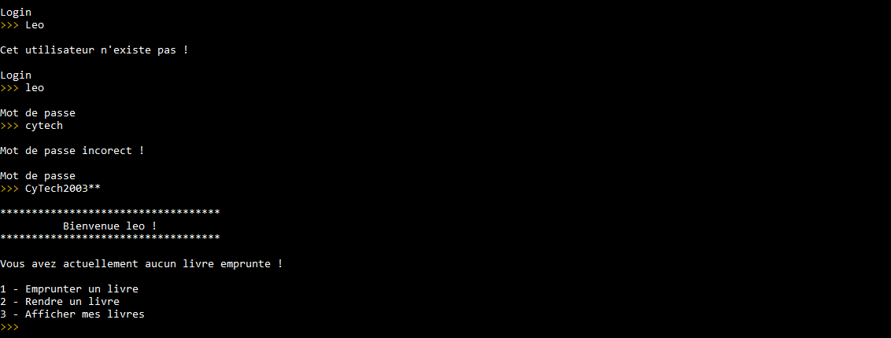
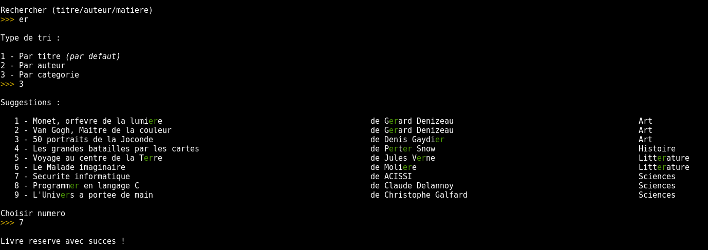
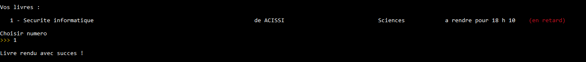
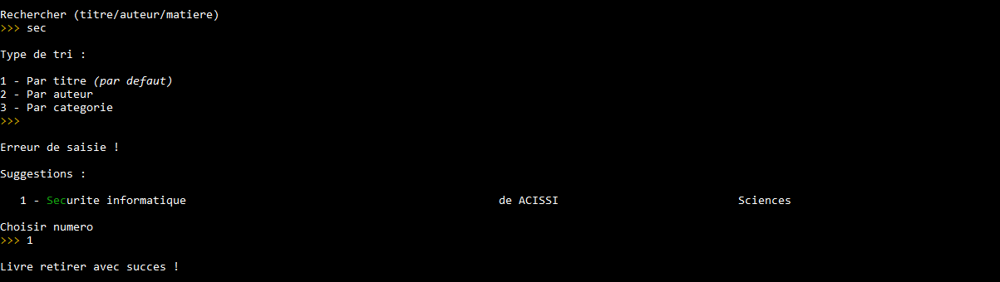

# CY-biblioTECH
A program to automatically manage the book stock of a university library !

## Installation

### Dependencies

Before you run CY-biblioTECH in your development environment, check you have installed GCC.

With Ubuntu or Debian, you can do (as root):

    apt-get install build-essential

### Clone the repository

To use CY-biblioTECH, you need to create your local clone of this repository :
    
    git clone https://github.com/melvinhqb/CY-biblioTECH.git

## Using CY-biblioTECH

### Compile CY-biblioTECH

To compile all the files needed to run the program, please write the following command in your terminal :

    make all

or

    make

### Run CY-biblioTECH

To run the compiled program, please write the following command in your terminal :

    ./exec

### Show all the Makefile's functions

For more information about secondary commands, please write the following command in your terminal :

    make help

## Program features

### Account creation

The account creation function requires a __non-existent user name__ and a __secure password__.

### Account connection

The function of connection to an account requires to give a __username__ and a __password__ registered __in the database__.

### Book reservetion

The book reservation function requires that there are __no delays__ in returning a book. Do a __book search__ (2 or 3 letters are sometimes enough) and select the __type of sorting__. Finally, simply __enter the number of the book__ you wish to return.

### Book return

The book return function requires that you have __reserved at least one book__. Simply __enter the number of the book__ you wish to return.

### Adding books

The add book function requires you to enter the __title__ of the book, the __author's name__, the __genre__ of the book and its identifier such as its __ISBN__.

### Deleting books

The book deletion function requires __at least one copy of the book__ to be deleted. The book is __not actually deleted__ from the database but the __stock counter is set to zero__.

## Authors

- Melvin Huynh-Quan-Binh _alias_ [@melvinhqb](https://www.github.com/melvinhqb)
- Augustin Verove _alias_ [@Hermeticis](https://github.com/Hermeticis)
